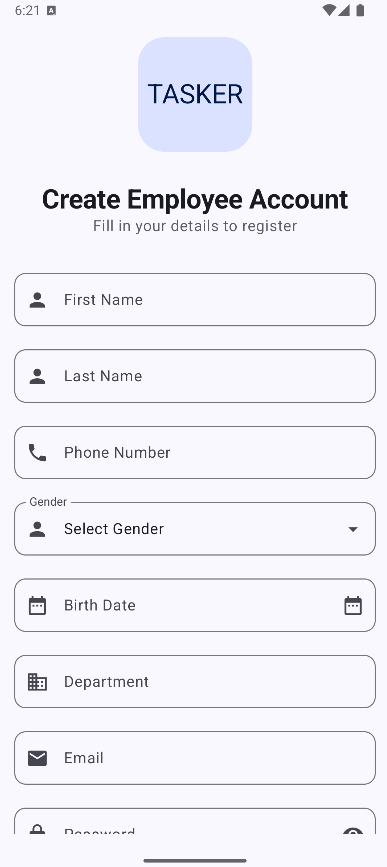
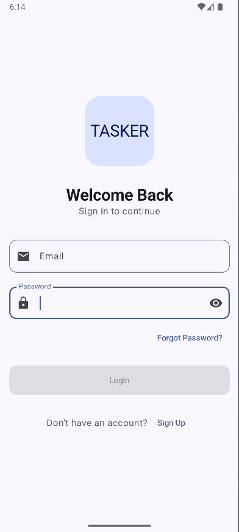
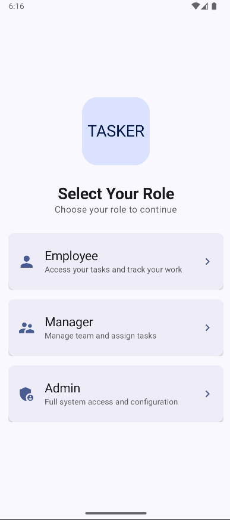

# Task Manager

## Overview
This Android application is designed to work with a .NET backend, allowing admins, managers, and employees to collaborate efficiently on tasks. Employees can update task statuses, while managers oversee task progress. The app features JWT authentication, offline caching, task notifications, and PDF export.

## Features (Coming Soon)
- **Admin Role**: Create departments and manage users.
- **Manager Role**: Assign tasks to employees.
- **Employee Role**: Update task status: *Working on it, Finished, or Will do later*.
- **Task Reporting**: Generate reports and track progress.
- **Task PDF Export**: Print tasks as PDFs.
- **Offline Caching**: View tasks even when offline.
- **JWT Authentication**: Secure user authentication.
- **Task Notifications**: Receive alerts for upcoming deadlines.
- **User Profiles**: Each user has a profile with relevant details.
- **Collaboration with .NET Backend**: Backend developed in collaboration with [Abdelrahman548](https://github.com/Abdelrahman548).

## Implemented Features
✅ Employee Login & Signup

## Screenshots
### Create Employee Account

### Login Screen

### Role Selection Screen

## Tech Stack
- **Architecture**: Clean Architecture, MVI (Model-View-Intent)
- **Android**: Kotlin, Jetpack Compose
- **Backend**: .NET (C#)
- **Authentication**: JWT
- **Networking**: Retrofit2
- **Database**: Room (Local), DataStore Preferences
- **Notifications**: Android Notifications
- **PDF Generation**: Android PDF API

## Contributing
We welcome contributions! If you're interested in improving the application, feel free to submit a pull request.

## License
This project is open-source under the MIT License.

