# Task Manager

A comprehensive Android application for company task management with role-based access control. This application allows administrators to manage departments and users, managers to create and assign tasks, and employees to view and complete assigned tasks.

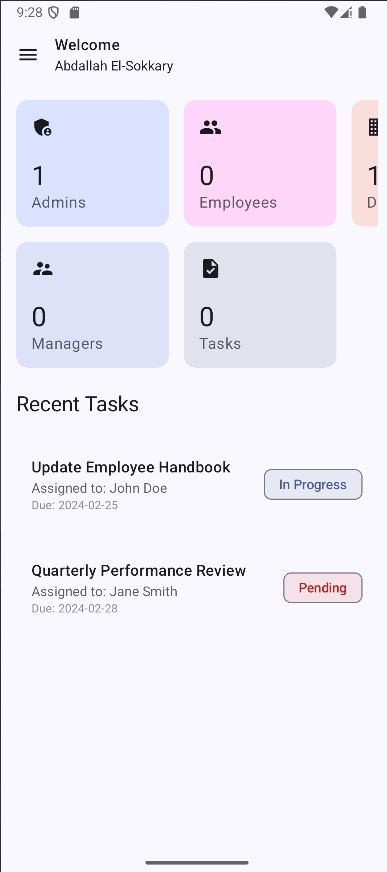

## Features

- **Role-based Access Control**: Three-tiered authorization system:
  - **Administrators**: Full system access, department creation, user management
  - **Managers**: Task creation and assignment, department oversight
  - **Employees**: Task viewing and completion

- **Department Management**:
  - Create and modify departments
  - View department details and members

  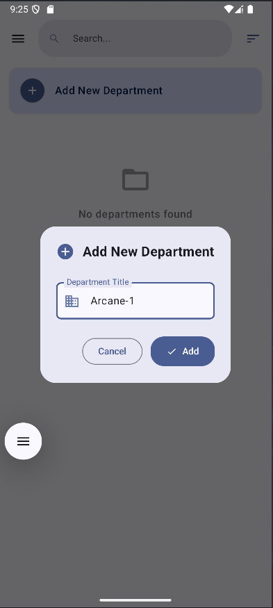
  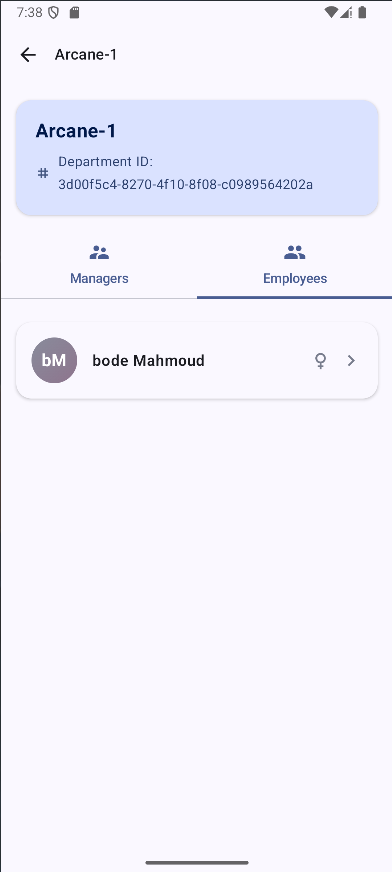

- **User Management**:
  - Create user accounts
  - Edit user profiles
  - Ban/disable user accounts

  
  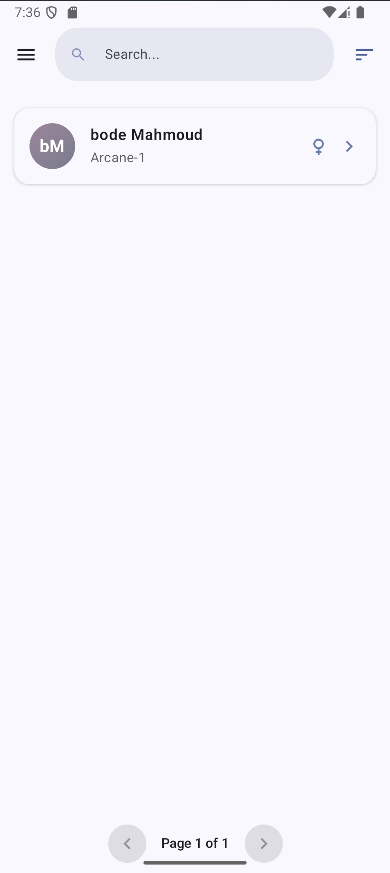
  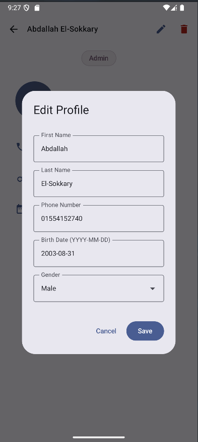
  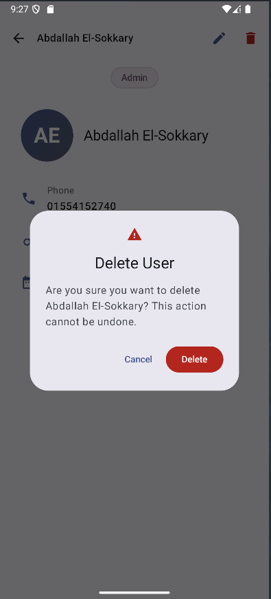

- **Task Management**:
  - Create and assign tasks to employees
  - Track task completion status
  - View tasks by department or employee

  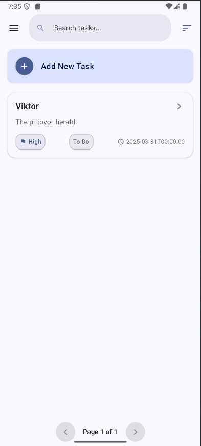
  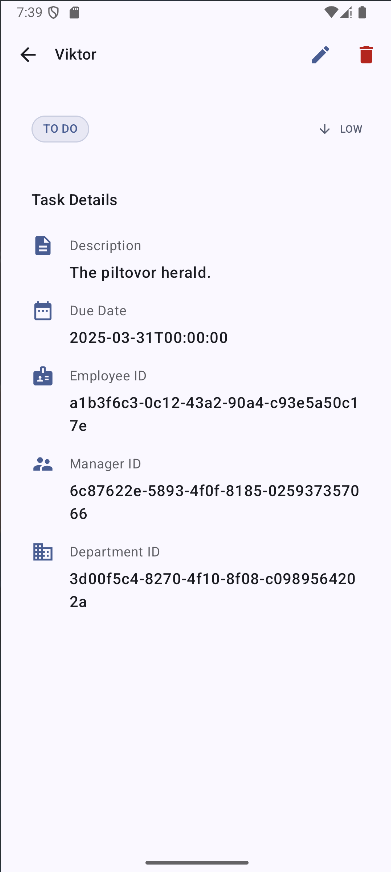
  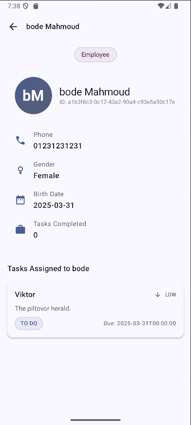
  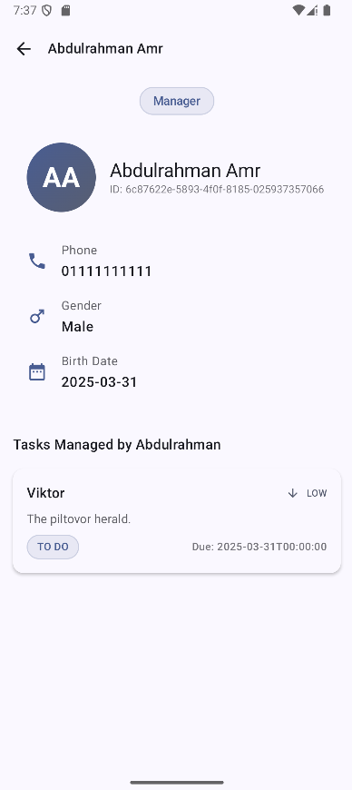
  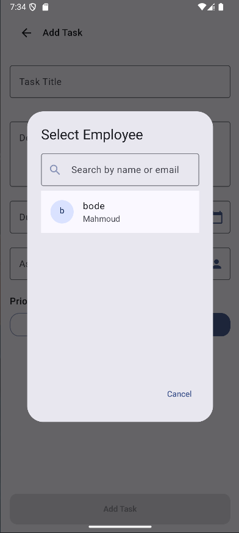

- **Authentication**:
  - Secure login system
  - Role selection interface

  
  

- **User Interface**:
  - Profile management screens
  - Managers overview dashboard

  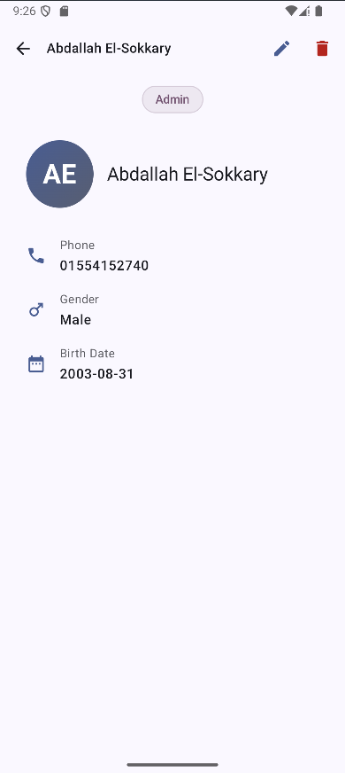
  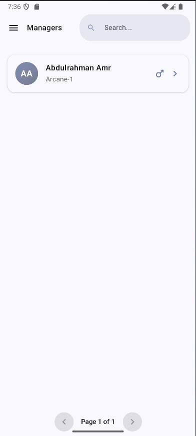

- **Settings**:
  - Application configuration options

  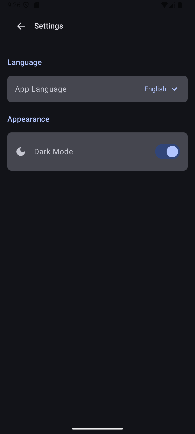

## Technical Implementation

### Key Technologies

- **Collaboration with .NET Backend**: Backend developed in collaboration with [Abdelrahman548](https://github.com/Abdelrahman548).
- **Architecture**: Clean Architecture, MVI (Model-View-Intent)
- **Android**: Kotlin, Jetpack Compose
- **Backend**: .NET (C#)
- **Authentication**: JWT
- **Networking**: Retrofit2
- **Database**: Room (Local), DataStore Preferences
- **Internationalization**: Full support for Arabic locale
- **UI Features**:
  - Animated navigation transitions
  - Splash screens

### Architecture & Design Patterns

- **Clean Architecture**: Separation of concerns with distinct layers:
  - Presentation layer (UI)
  - Domain layer (Business logic)
  - Data layer (Repository & Data sources)

- **MVI (Model-View-Intent)**: Unidirectional data flow for predictable state management

- **Nested Navigation**: Optimized navigation framework to save memory from unnecessary ViewModel instances

### Technical Stack

- **Dependency Injection**:
  - Hilt for dependency management

- **Concurrency**:
  - Kotlin Coroutines for asynchronous operations

## Backend Integration

This Android application connects to a .NET backend service (not included in this repository). The backend handles:

- User authentication and authorization
- Data persistence
- Business logic validation
